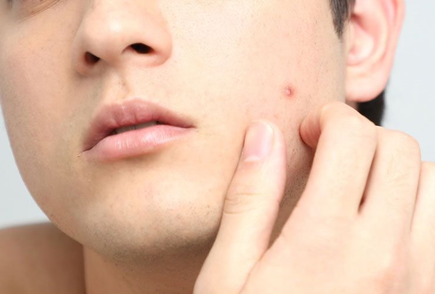

# ACNE REMOVER

Took a professional headshot to upload onto Linkedin, but realized that you had a big pimple on your forehead that you can't get rid of? This code is for you!

This code uses gradient based matching; it finds the gradient in the x and y direction in the border of the ROI and interpolates them along the region. As long as the region you select is generally in a uniformly shaded area, it should work great!

Create a conda environment and set up dependencies via
```
conda create --name env-name python=3.6
conda install -c menpo opencv
```

Then run `python acne_popper.py`. Select the _Top Left_ point, then the _Bottom Right_ point of an ROI around the pimple. The example image is pulled from google images. 
# Example


